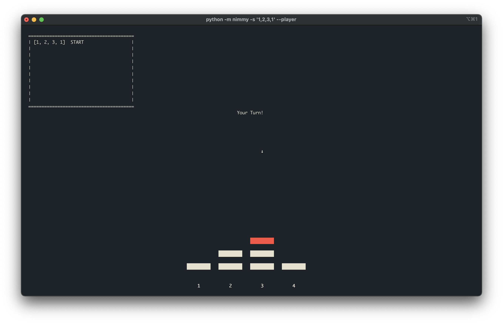

```
 _   _ _                           
| \ | (_)                                
|  \| |_ _ __ ___  _ __ ___  _   _ 
| . ` | | '_ ` _ \| '_ ` _ \| | | |
| |\  | | | | | | | | | | | | |_| |
\_| \_/_|_| |_| |_|_| |_| |_|\__, |
                              __/ |        
```

Nimmy is a simple terminal UI for playing a modified version of the game Nim given an initial configuration
of the piles. This modified version of Nim is different from the traditional rules in the sense that there are three ways
of winning/losing - adding complexity to decision making. In particular, a player will lose the game if on the start
of their turn

- all piles are empty.
- 3 piles each with 2 objects, and all other piles are empty.
- 1 pile with 1 object, 1 pile with 2 objects, 1 pile with 3 objects, all other piles are empty.
- 2 piles with 1 object, 2 piles with 2 objects, all other piles empty. 



### Run Guide:
Running this project is very simple with Blessed and Python 3.7+ being the only two major requirements. 
All commands are to be ran from the project directory. There are a few options for how to run this project. The easiest
is to run 
```console
foo@bar:~$ pip install nimmy 
```
Which can then be done with 
```console
foo@bar:~$ nimmy -s '1,2,3,2'
```
Alternatively, 

```console
foo@bar:~$ python ./setup.py install
foo@bar:~$ python -m nimmy '1,2,3,2'
```
There are several runtime parameters that can be used to run nimmy: 

```console
optional arguments:
  -h, --help            show this help message and exit
  --cpu                 Boolean flag to denote if the cpu goes first

required arguments:
  -s STATE, --state STATE
                        String of non-negative integers separated by commas
                        representing the initial state of the board

```
